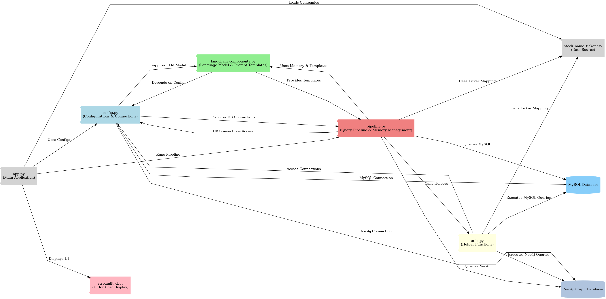

# Agentic RAG System for Stock Market Analysis

## Project Overview

This project is an **Agentic RAG (Retrieval-Augmented Generation) System for Stock Market Analysis** that combines historical stock performance data with sentiment analysis from news articles, offering investors, analysts, and researchers a comprehensive tool to make informed decisions. Using MySQL for structured stock data and Neo4j for sentiment-tagged news articles, the system provides advanced trend and sentiment insights, which are accessible via natural language queries.

## What is Agentic RAG?

Agentic RAG systems are designed to interpret user questions, dynamically retrieve relevant data, and generate responses using a blend of database querying and natural language generation. Unlike traditional RAG setups that rely on vector databases, this project uses **MySQL** for structured data and **Neo4j** for graph-based sentiment data, both of which are commonly used in enterprise environments, making the system accessible and scalable in traditional data settings.

## Unique Approach

A unique feature of this project is the choice of **structured and graph databases** (MySQL and Neo4j) over vector databases, a standard in many RAG implementations. This choice aligns with typical enterprise data infrastructure, leveraging the compatibility, robustness, and wide adoption of these databases without the need for specialized vector storage. This approach facilitates easy integration into existing enterprise setups, where structured and graph databases are more prevalent.

## Objectives

1. **Stock Trend Analysis**: Analyze historical stock data to identify trends and patterns, offering users insights into market performance.
   
2. **Sentiment Analysis Integration**: Include sentiment scores from recent news articles to add context on public sentiment, helping users make sentiment-aware predictions.

3. **Dynamic Querying with RAG**: Use natural language understanding and retrieval to convert user inputs into database queries, dynamically fetching relevant stock and sentiment data.

## How LangChain Facilitates the Agentic RAG

This project leverages **LangChain** to power several Agentic RAG features, enhancing query generation, memory handling, and conversation structuring:

- **Dynamic Routing and Query Selection**: LangChain components route user queries to the appropriate database—MySQL for stock trends and Neo4j for sentiment data—using custom prompts for SQL and Cypher.
  
- **Query Restructuring and Transformation**: LangChain’s prompt templates assist in transforming and adapting queries based on context, rephrasing, and user follow-up requests.
  
- **Conversation Memory**: LangChain’s `ConversationBufferMemory` stores past interactions, enabling seamless follow-up questions and maintaining conversational context.

## Custom Modules and Adaptations

As this system does not rely on a vector database, custom modules were developed to handle query restructuring, data retrieval, and company-specific memory handling:

- **Query Rephrasing**: Using the `rephrase_query` function, user queries are refined for accuracy before being processed.
  
- **Dynamic Query Transformation**: Queries are adjusted to meet specific user needs, such as expanding result limits or targeting date ranges based on past interactions.

- **Custom Memory for Company-Specific Data**: A `custom_memory` module tracks company-specific queries and interactions, maintaining focus on the selected company and allowing follow-up questions on the same stock.

## System Workflow




## How the System Works

The system processes queries through an agentic RAG pipeline that includes structured data handling, natural language processing, and dynamic query execution. Here’s an overview of the system workflow (refer to the architecture diagram for visual details):

1. **User Interface**: A Streamlit-based interface allows users to ask questions in natural language, select companies, and view response histories.
   
2. **Natural Language Query Processing**: LangChain interprets user queries, selects the appropriate query prompt template, and translates questions into SQL or Cypher commands.

3. **Data Retrieval and Response Generation**:
   - **MySQL** handles stock trend queries and retrieves historical price and volume data.
   - **Neo4j** manages sentiment queries, fetching relevant news articles and sentiment scores.
   
4. **Conversation Memory and Context Maintenance**: Memory components retain the context of previous conversations, enabling follow-up questions and enhancing the assistant’s ability to respond accurately.

## Data and Pre-Processing Overview

The data used in this project is preprocessed to ensure accuracy and consistency:

- **Stock Data**: Contains historical records of stock prices and volumes, stored in MySQL. Preprocessing includes cleaning, normalization, and handling missing values. Details can be found in the [Pre-Processing README](https://github.com/bhanup6663/stock_agent_RAG/tree/main/pre-process).

- **News Data**: Comprises sentiment-analyzed articles from Yahoo Finance, stored in Neo4j. Preprocessing involves data cleaning, sentiment tagging, and entity linking. For more information, refer to the [Pre-Processing README](https://github.com/bhanup6663/stock_agent_RAG/tree/main/pre-process).

## Data Store Preparation and Insertion

The system uses two databases for data storage and retrieval:

- **MySQL**: For storing structured stock data, including date, open/close prices, volume, and adjusted close values. Details on setup and data insertion can be found in the [MySQL README](https://github.com/bhanup6663/stock_agent_RAG/tree/main/mysql).

- **Neo4j**: For storing sentiment-tagged news articles and establishing relationships between companies, articles, and sentiment scores. See the [Neo4j README](https://github.com/bhanup6663/stock_agent_RAG/tree/main/neo4j) for details on setup and data insertion.

## Detailed Project Workflow

Below is an outline of the core application code (`app.py`) and module functionalities:

1. **User Interface (app.py)**:
   - Allows users to select companies, enter queries, and view responses.
   - `streamlit_chat` displays chat history and integrates real-time responses.
   - Sidebars for company selection and session resets.

2. **LangChain Components (langchain_components.py)**:
   - Contains LangChain’s prompt templates for SQL and Cypher queries.
   - Sets up conversation memory, allowing for seamless follow-up interactions.

3. **Pipeline (pipeline.py)**:
   - Runs the end-to-end pipeline from user query processing to response generation.
   - Manages memory updates, query transformation, and routing to MySQL or Neo4j.

4. **Utility Functions (utils.py)**:
   - Executes SQL and Cypher queries, handles company name-to-ticker mapping, and manages database connections.

5. **Configuration (config.py)**:
   - Sets up sensitive database connections (MySQL, Neo4j) and initializes the language model.
   - Note: `config.py` is excluded from the public repository to maintain confidentiality.

## Running the Project

To run the project locally:

1. **Set up Databases**:
   - Follow the setup instructions in the [MySQL README](https://github.com/bhanup6663/stock_agent_RAG/tree/main/mysql) and [Neo4j README](https://github.com/bhanup6663/stock_agent_RAG/tree/main/neo4j) to set up the required databases.

2. **Install Dependencies**:
   - Install required packages by running:
     ```bash
     pip install -r requirements.txt
     ```

3. **Run the Application**:
   - Launch the Streamlit application with:
     ```bash
     streamlit run app.py
     ```

4. **Interact with the System**:
   - Use the interface to select a company, ask questions, and receive stock data and sentiment insights from the RAG pipeline.

<!-- ## Demo Video

[Watch the Demo Video](path/to/demo_video.mp4) -->


---

